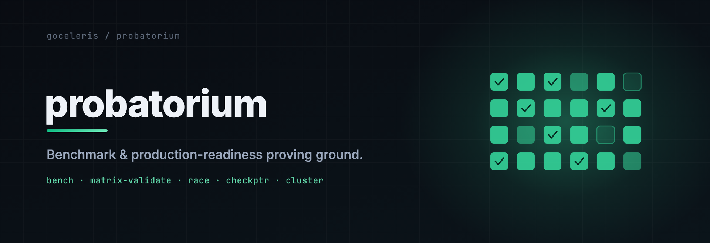

<p align="center">
  
</p>

# probatorium

[](https://github.com/goceleris/probatorium/actions/workflows/matrix-nightly-tier.yml?query=branch%3Amain)
[](https://github.com/goceleris/probatorium/actions/workflows/matrix-weekend-tier.yml?query=branch%3Amain)
[](https://github.com/goceleris/probatorium/actions/workflows/test.yml)
[](https://github.com/goceleris/probatorium/actions/workflows/lint.yml)
[](LICENSE)

The benchmark and production-readiness proving ground for [celeris](https://github.com/goceleris/celeris).

probatorium drives a real 3-host cluster over a real network and asks two questions of every celeris build: **how fast is it** (throughput and latency-at-SLO against a broad field of competitors) and **is it correct under stress** (property checks, stateful fuzzing, and deterministic fault replay). It is the harness behind the numbers and correctness claims published at [goceleris.dev](https://goceleris.dev).

Load is generated by [`goceleris/loadgen`](https://github.com/goceleris/loadgen) (pinned to `v1.4.13`). Results are published to [`goceleris/docs`](https://github.com/goceleris/docs). This is one of the `goceleris/{celeris,loadgen,probatorium,docs}` family.

The two tier badges above are the canonical correctness signal for celeris on `main`: green means the last nightly / weekend matrix run over `(refapp × engine × arch)` was clean — no HIGH-severity invariant violation, no cross-engine or cross-arch divergence.

## What it does

probatorium runs two independent tiers against the same cluster.

| Tier | Flow | Purpose |
|---|---|---|
| **bench** | msa2-client → {msa2-server, msr1} | Throughput and latency-at-SLO across celeris and a field of 29 competitor frameworks in 10 languages |
| **validation** | msa2-client → {msa2-server, msr1} | Continuous property checks, RESTler-style stateful fuzzing, and replayable deterministic fault injection |

The bench headline metric is **`latency_at_slo`** — the maximum sustained RPS at which the merged-HdrHistogram P99 stays under each SLO threshold in `{10, 50, 100, 500, 1000}` ms. Saturation RPS answers "how much can it push"; `latency_at_slo` answers "how much can it push *while staying responsive*", which is the number that ranks the field where saturation ceilings collapse together (notably the store-bound driver rows).

The validation operational claim is simpler: **N days of continuous soak with zero invariant violations, on both architectures, across every refapp × every engine → the build is production-ready.** The weekend tier runs a 24h soak weekly (Sunday cron) to track regressions between full cycles.

## The field

The saturation grid is `52 columns × 29 scenarios`, capability-gated. Columns come from `servers.Registry`:

- **celeris** contributes **9 engine-mode columns** — every combination benched side by side: `{iouring, epoll, std, adaptive}` engines × `{h1, auto+upg}` wire modes × `{sync, async}` handler dispatch (`std` is single-mode). This is how the matrix isolates, for example, whether an io_uring regression is engine-specific or wire-mode-specific.
- **`stdhttp`** is the Go `net/http` baseline (h1 / h2 / hybrid).
- **29 distinct competitor frameworks across 10 languages** provide the field:

| Language | Frameworks |
|---|---|
| Go (10) | chi, echo, fasthttp, fiber, gin, gnet, gorilla, hertz, iris, nbio |
| Rust (4) | actix-web, axum, hyper, ntex |
| Bun (3) | bunraw, elysia, hono |
| Node / JS (3) | express, fastify, uWebSockets.js |
| C++ (2) | drogon, lithium |
| Java (2) | netty, vertx |
| Python (2) | fastapi, starlette |
| C (1) | h2o |
| C# (1) | aspnet |
| Zig (1) | httpzig |

`servers.Registry` is the single source of truth — do not count adapter directories, since a directory can exist without being registered. Adding a framework is a registry entry plus an adapter directory; the matrix runner discovers the rest.

### Capability gating

Not every scenario runs against every server. Each adapter declares a `FeatureSet` (which scenario categories it can host — drivers, middleware, streaming, TLS, wire protocols), and each scenario implements `Applicable(servers.FeatureSet) bool`. The scheduler evaluates `Applicable` for every `(server, scenario)` pair and skips the mismatches **before** dialing loadgen — so a Python framework with no native Postgres path never shows up as a spurious zero in the driver table. This is why the realized cell count (813) is well below the raw `52 × 29` product.

## Quick start

Everything is driven through [mage](https://magefile.org) targets. `CLUSTER_USE_LAN=1` pins traffic to the 20G LACP fabric (`192.168.50.0/24`) instead of the Tailscale overlay — required for any meaningful bench, since Tailscale adds a latency floor that swamps the smaller cells.

```sh
# Cluster reachability + manifest state.
mage Status

# Cross-compile every binary + ship to the cluster.
# DEPLOY_COMPETITORS=go-only skips native toolchains (sub-minute deploy).
CLUSTER_USE_LAN=1 DEPLOY_COMPETITORS=go-only mage Deploy

# Smoke bench: two columns × 15s on amd64 (the bench always runs one pass).
CLUSTER_USE_LAN=1 \
  BENCH_TARGET=msa2-server \
  BENCH_COMPETITORS=stdhttp,gin \
  BENCH_DURATION=15s BENCH_WARMUP=3s \
  mage Bench

# Single-cell validation smoke (one refapp, one engine): 10-min on amd64.
CLUSTER_USE_LAN=1 \
  VALIDATE_TARGET=msa2-server VALIDATE_DURATION=10m \
  mage Validate

# Full-matrix validation: every refapp × every engine, populating Cells[].
CLUSTER_USE_LAN=1 \
  VALIDATE_TARGET=msa2-server VALIDATE_DURATION=10m \
  VALIDATE_MATRIX=1 \
  mage Validate

# Always-on cluster pristine reset.
CLUSTER_USE_LAN=1 mage Cleanup
```

## Bench tier

### Profiles

A bench run is fully described by a **profile** (`budget.ForProfile`), which fixes the grid, the per-cell window, and whether the rated/SLO sweep runs. The bench **always runs exactly one pass** (`Runs=1`); more coverage means more dispatches, not more passes per cell.

| Profile | Grid | Rated/SLO sweep | Per-cell window | Approx wall-clock (1 arch) |
|---|---|---|---|---|
| **Fast** *(default)* | full `*/*`, 813 cells | **off** — saturation only | 35s active / 10s warmup | ~14h — fits the 24h slot |
| **Headline** | full `*/*`, 813 cells | on, 388 rated cells | 40s active / 12s warmup | over 24h — manual, needs raised `BENCH_BUDGET` |
| **Full** | full `*/*`, 813 cells | on, 388 rated cells | 90s active / 20s warmup | well over 24h — manual, needs raised `BENCH_BUDGET` |

All three cover the **same full grid** — every registered server × every registered scenario, capability-gated. They differ only in the per-cell window and whether the rated sweep is included. The weekly cron runs **Fast**: saturation-only across the whole field, which is the cheap, full-breadth cadence that still fits the cluster's 24h slot. Headline and Full add the expensive additive dimension (rated) and are manual `BENCH_BUDGET` dispatches.

The **rated/SLO sub-sweep** is what produces `latency_at_slo`. For each of the 388 rated cells the runner drives **4 closed-loop passes at successively higher offered load**, each pass 20s active + 10s warmup (Full uses 30s / 15s). The rated set is the subset of scenarios where throughput-at-SLO carries signal saturation misses — the driver rows (adapters pile up at identical store-bound ceilings there, so tail latency is the only thing that ranks them), the two static headline rows, and churn-close.

### Result: latency at SLO

The headline table is `latency_at_slo`: rows are adapters, columns are the SLO thresholds `{10, 50, 100, 500, 1000}` ms, and each cell is the max sustained target RPS whose merged-HdrHistogram P99 stayed under that budget. Histograms are merged across the cluster by `goceleris/loadgen` so the P99 reflects the whole run, not a single host's slice.

## Validation tier

Three pipelines run against every validation cell.

### Tier 1 — always-on property stress

Five slices fan out over `Concurrency` walker goroutines. The walker budget activates progressively, so small smoke runs don't pay for the expensive slices:

| Slice | % of walkers | Activates at concurrency ≥ | What it does |
|---|---|---|---|
| Markov | ~60% | 1 | Session-shaped traffic over the refapp's OpenAPI endpoints, transitions weighted by `validation/markov/<refapp>.yaml` |
| Adversarial | ~20% | 1 | Raw-TCP malformed HTTP/1.1 — bad chunks, oversized headers, NUL in header, CRLF injection, slowloris, double Content-Length |
| h2c upgrade churn | ~10% | 10 | Valid h2c upgrade preambles then RST at three different stages — exercises the engine's PauseAccept race (celeris commits `ed55fb6` + `bd675f9`) |
| WS frame torture | ~5% | 4 | Real RFC 6455 handshake then one of: fragmented-reserved opcode, oversize payload, unmasked client, ping flood, continuation-no-start, invalid UTF-8 |
| SSE kill-mid-stream | ~5% | 4 | Establish an SSE long-poll, hold 50–1500ms, RST — the broker must clean up the client slot (I-CONN-2 catches a stuck broker) |

Each slice keeps its own `tally`. **HIGH-severity counters** are must-be-zero invariants: the orchestrator trips the reactive incident path the FIRST time one goes non-zero, firing forensics and auto-bisect mid-run rather than at end-of-run.

| Counter | Predicate ID | Interpretation |
|---|---|---|
| `adv.wrong_accepted > 0` | `I-ADV-ACCEPTED` | Server accepted malformed bytes — RFC violation |
| `h2c.crashed > 0` | `I-H2C-CRASHED` | Engine crashed on upgrade — PauseAccept race fired |
| `ws.accepted_bad_frame > 0` | `I-WS-ACCEPTED` | Server accepted an RFC 6455 violation |
| `ws.hang_no_close > 0` | `I-WS-HANG` | WebSocket goroutine wedged |
| `drv.read_after_write_mismatch > 0` | `I-DRV-1` | Postgres / Redis / Memcached driver lost a write |

### Tier 2 — RESTler-style stateful fuzzing

Producer/consumer dependency inference from `validation/spec/<refapp>.openapi.yaml`. Catches API-level bugs Tier 1 misses — e.g. "DELETE twice → does the second 404 corrupt the session?".

### Tier 3 — deterministic seed replay

Real kernel, no mocking. A seed expands into a workload plus a fault schedule; a bug is the tuple `(seed, git_commit, host_arch)`, reproducible with `validator-replay --seed=… --commit=… --target=msa2-server`. The seed corpus under `validation/corpus/` starts at 100 hand-authored seeds and grows over time; the PR tier runs 200 seeds (~10min), nightly 1000, weekend continuous-loop.

### Invariants

Beyond the Tier-1 HIGH-severity counters, the orchestrator runs a **per-second property loop** inside every cell (`validation/propertyloop.go`, shared evaluator in `validation/checker`): once the refapp announces its real address, it polls the refapp's `/debug/vars` (served by every refapp via `validation/refapp/internal/debugvars`, alongside `/debug/pprof` for incident forensics), samples the refapp's RSS from `/proc`, and evaluates the registered `I-*` predicates against a rolling 1 h history.

Every violation is counted into `tier_1.property_violations` / `property_violation_ids`, and `mage ValidateGate` fails on any of them. What the first violation of a predicate does to the *cell* is a switch:

- **record-only** (default, `VALIDATE_PROPERTY_HARD_FAIL` unset): an incident dossier with live forensics (`/proc`, the five `/debug/pprof` profiles, gcore, dmesg) is written while the refapp is still running, and the cell continues to its budget so the leak's whole trajectory is on record. This is the calibration mode: the slope budgets below have not yet been run against a real cell, and a false positive costs a dossier, not a 24 h soak slot.
- **hard fail** (`VALIDATE_PROPERTY_HARD_FAIL=1` / `-property-hard-fail`): the same dossier and forensics are captured *before* the tiers are torn down (the refapp dies with the run context, so capturing afterwards yields only `.missing` markers), then the cell is cancelled and the validator exits non-zero.

Each cell reports `properties_passed` / `properties_failed` / `properties_not_instrumented` / `properties_not_judged`. A predicate counts as passed only if it reached a **verdict** at least once and never failed; one that only ever *skipped* (its window never became judgeable) is listed under `properties_not_judged`, and one with no data source under `properties_not_instrumented`. The gate (by default, for documents of schema ≥ 5.6) also fails a cell whose loop never evaluated anything (`property_evaluations == 0`, i.e. `/debug/vars` unreachable), unless `tier_1.property_loop_skipped` names a reason (the ssh driver, whose remote refapp is loopback-only).

Instrumented today:

- `I-LIVENESS` / `I-HANG` — the refapp process stayed up and responsive (walker-driven, not part of the snapshot loop).
- `I-PANIC` — no panic was recovered by the refapp (counted from the recovery middleware's log stream).
- `I-CONN-2` — `accepted − closed − active == 0` (refapp `OnConnect`/`OnDisconnect` counters vs. the engine's active gauge), judged only when the drift persists with the same sign for 30 samples.
- `I-MEM-1` — `heap_inuse` trough slope ≤ 1 KB/s over the trailing min(1 h, elapsed) after a 5 min warm-up, judged from 10 min of samples.
- `I-MEM-3` — goroutine-count trough slope ≤ 0.2/s over the trailing 10 min after warm-up (the celeris#494 leak class: 3 goroutines per killed SSE stream is judged at t=15 min and declared at t≈17.5 min).
- `I-MEM-4` — RSS trough slope ≤ 64 KB/s over the trailing min(1 h, elapsed) after warm-up (linux, local driver; reported as not instrumented otherwise).

The three slope oracles share a false-positive guard: the fit runs over per-150 s bucket **minima** (a GC sawtooth cannot masquerade as a slope), and a slope above budget is a verdict only if the rise across the window also clears `max(budget × 10 min, a fraction of the series' level (3 % heap / 5 % goroutines, RSS), 8× the sampling noise of the sawtooth at that heap size)`, so neither a single legitimate floor step (a cache filling once, a standby engine spinning up, the heap goal moving) nor the trough-sampling noise of a large live heap can fire them. A verdict must then persist for 150 consecutive evaluations (one bucket width, a complete re-bucketing of the window) before it is declared. These oracles need ≥ 15 min cells (warm-up + window): they judge in the weekend soak's 1 h cells, and are reported as `properties_not_judged` in the ~150 s nightly cells. Refapps whose in-memory TTL stores keep growing past warm-up (a session per cookieless request until celeris#487's fix reaches the pinned celeris) are expected true positives for `I-MEM-1`, not noise.

Registered but **not instrumented** (they pass vacuously and are listed under `properties_not_instrumented` rather than counted as passed): `I-CONN-1` (needs a per-connection last-byte table), `I-RFC-1`/`I-RFC-2` (need the response scraper), `I-RACE`/`I-CHECKPTR` (refapps are not built with `-race`/`-d=checkptr`; `-race` needs cgo, which the `CGO_ENABLED=0` cross-compile forbids), `I-MEM-2` (needs an orchestrator-driven idle window), `I-MW-*`/`I-ENG-IOURING` (counters exist only in `-tags=validation` builds of celeris).

### Cross-engine and cross-arch divergence as an invariant

A matrix run emits a v5.5 `validate-results.json` whose `Cells[]` holds one entry per `(refapp, engine, arch)`. `mage ValidateDiff` walks the two latest matrix docs and reports:

- **Cross-engine** divergence: a HIGH-severity counter non-zero on one engine (e.g. `iouring`) but zero on another (`epoll` / `std`) for the same `(refapp, arch)` — typically an engine-specific bug.
- **Cross-arch** divergence: the same shape, comparing amd64 ↔ arm64.

It exits non-zero on HIGH severity and persists `validate-diff/diff.{txt,json}` for dashboards. It runs automatically in the CI tiers below.

## Refapps

Each refapp is a **separate Go module** under `validation/refapp/<slug>/`, so the validator binary never pulls in every middleware's dependency graph. The matrix runner auto-discovers them at runtime.

| Slug | Coverage |
|---|---|
| `auth_session_ratelimit` | session cookie + ratelimit + WS / SSE detach paths |
| `auth_jwt_csrf` | JWT (HS256), CSRF synchronizer-token, keyauth |
| `kitchen_sink` | 16 stateless middlewares: recovery, requestid, secure, cors, bodylimit, methodoverride, rewrite, redirect, healthcheck, ratelimit, timeout, circuitbreaker, idempotency, singleflight, basicauth + per-route etag/cache |
| `driver_postgres` | native postgres driver + session/postgresstore + I-DRV-1 round-trip |
| `driver_redis` | native redis driver + session/redisstore + ratelimit/redisstore (atomic EVALSHA token-bucket) |
| `driver_memcached` | native memcached driver + session/memcachedstore + ratelimit/memcachedstore (CAS-loop token-bucket) |
| `observability` | logger + metrics + otel, scraped via `/metrics` for histogram-monotonicity + log-drop invariants |
| `static_swagger_proxy` | static (embed.FS) + swagger (OpenAPI 3.0) + proxy (X-Forwarded-For trust) |

Each follows the same shape: its own `go.mod`, an `engine.go` (`resolveEngine("auto")` → io_uring on Linux, std elsewhere), `platform_{linux,other}.go` for the `isLinux()` split, signal-driven graceful shutdown, and a canonical `ready addr=<bind-addr>` startup line.

## Mage targets

| Target | Env knobs |
|---|---|
| `Status` | — |
| `Deploy` | `CLUSTER_USE_LAN`, `DEPLOY_COMPETITORS=all\|go-only\|none\|<list>` |
| `Cleanup` | `CLEANUP_HOSTS=all\|<list>` |
| `Bench` | `BENCH_TARGET`, `BENCH_COMPETITORS`, `BENCH_DURATION`, `BENCH_WARMUP`, `BENCH_CELLS`, `BENCH_RATED`, `BENCH_RATED_DURATION`, `CELERIS_VERSION` |
| `BenchTier` | `BENCH_PROFILE=fast\|headline\|full`, `BENCH_BUDGET`, `BENCH_TARGET` — the profile-driven curated sweep the weekly workflow runs |
| `BenchSince` | `BASELINE_VERSION=v1.4.2`, `REGRESSION_THRESHOLD=0.05` |
| `Validate` | `VALIDATE_TARGET`, `VALIDATE_DURATION`, `VALIDATE_PARALLEL=1`, `VALIDATE_MATRIX=1`, `VALIDATE_MATRIX_REFAPPS=<csv>`, `VALIDATE_MATRIX_ENGINES=<csv>`, `VALIDATE_REFAPP_ENGINE`, `CELERIS_VERSION`, `PROBATORIUM_VALIDATE_DRIVER=ssh` |
| `Soak` | `SOAK_DURATION=24h`, `VALIDATE_TARGET`, `VALIDATE_PARALLEL=1`, `VALIDATE_MATRIX=1` |
| `ValidateDiff` | `VALIDATE_DIFF_STRICT=1` (treat MED as failure), `VALIDATE_DIFF_HOSTS=a,b` |
| `Fuzz` | `FUZZ_DURATION=30m`, `FUZZ_CORPUS` |
| `Publish` | `PUBLISH_VERSION`, `PUBLISH_EVENT_TYPE=celeris-bench`, `DOCS_TOKEN` |
| `PublishValidate` | same + `PUBLISH_EVENT_TYPE=celeris-validate` |
| `BenchAndValidate` | Validate → ValidateDiff → PublishValidate → Bench → Publish |

`VALIDATE_PARALLEL=1` on a two-arch run fans the per-target ansible-playbook invocations over goroutines, halving wall-clock on long soaks.

### Matrix mode (`VALIDATE_MATRIX=1`)

Iterates `(refapp × engine)` cells, runs a fresh orchestrator per cell with a per-cell budget of `total_duration / len(cells)`, and emits one matrix-aware v5.5 `validate-results.json` with `Cells[]` populated. It falls back to single-cell behaviour when unset (preserving back-compat). Filter the matrix with:

- `VALIDATE_MATRIX_REFAPPS=driver_postgres,driver_redis` — limit refapps.
- `VALIDATE_MATRIX_ENGINES=iouring,epoll` — limit engines (defaults to the OS production set: iouring + epoll + std on Linux, std elsewhere).

## Result layout

```
results/<ts>-bench-<version>/
  results.json                             # cross-host v5 roll-up
  raw/<host>.json
  <TS>-bench-<host>/<RR>-<comp>/
    loadgen.json                           # HdrHistogram-bearing loadgen.Result
    observer.sqlite                        # 1Hz /proc + runtime metrics
    cpu.log, server.log

results/<ts>-validate-<version>/
  <host>-validate-<refapp>/
    validate-results.json                  # single-cell v5.5 ValidationResults
    tier1_tally.json                       # Tier 1 sub-tally sidecar
    tier3_tally.json                       # Tier 3 seed corpus sidecar
    incidents/<ts>-<predicate>/            # forensics dossier per violation
      forensics_status.txt
      proc-maps.txt, proc-status.txt, proc-fd.txt
      pprof.heap.gz, pprof.goroutine.txt
      shrink/                              # auto-bisect repro
  validate-diff/
    diff.txt                               # severity-sorted divergence table
    diff.json                              # structured findings for dashboards

results/<ts>-validate-matrix-<arch>/       # matrix-mode runs
  validate-results.json                    # v5.5 top-level (Cells[] populated)
  cell-<NN>-<refapp>-<engine>/
    validate-results.json                  # per-cell single-doc
```

## v5.5 result schema

The matrix-mode document carries a per-cell breakdown; single-cell runs leave `Cells[]` empty and populate `Tier1`/`Tier3` at the top level for back-compat.

```jsonc
{
  "schema_version": "5.5",
  "host_arch_pair": "msa2-server-amd64",
  "validation_results": {
    "started_at": "...", "finished_at": "...",
    "cells": [
      {
        "refapp": "auth_session_ratelimit",
        "engine": "iouring",
        "arch": "amd64",
        "tier_1": {
          "requests_sent": 1234567, "requests_2xx": 1230000, ...,
          "adversarial": { "adv_sent": 50000, "adv_well_rejected": 49998,
                           "adv_wrong_accepted": 0, "adv_hang_until_timeout": 2 },
          "h2c_churn":   { "h2c_sent": 25000, "h2c_upgraded": 0,
                           "h2c_declined": 25000, "h2c_crashed": 0, "h2c_hang": 0 },
          "ws_torture":  { "ws_sent": 12000, "ws_upgraded": 12000,
                           "ws_closed_correctly": 12000, "ws_accepted_bad_frame": 0,
                           "ws_hang_no_close": 0 },
          "sse_kill":    { "sse_sent": 8000, "sse_established": 8000,
                           "sse_events_read": 240000, "sse_killed_mid_stream": 7950,
                           "sse_server_closed_early": 50, "sse_handshake_fail": 0 }
        },
        "tier_3": { "seeds_attempted": 144, "seeds_passed": 144,
                    "seeds_failed": 0, "seeds_errored": 0 }
      },
      { "refapp": "auth_session_ratelimit", "engine": "epoll", "arch": "amd64", ... },
      { "refapp": "auth_session_ratelimit", "engine": "std", "arch": "amd64", ... },
      { "refapp": "kitchen_sink", "engine": "iouring", "arch": "amd64", ... }
    ]
  }
}
```

Sub-tallies are `map[string]int64`, so the schema doesn't re-version when the validator grows a counter.

## Continuous integration

All CI runs on `[self-hosted, celeris-cluster]` runners that are provisioned on demand and torn down at end-of-run — no daemons left on the cluster between runs (the pristine rule). The earlier celeris-release-triggered cascade (a release poller gating `validate` → `bench`) has been retired; the workflows under `.github/workflows/` are:

| Workflow | Trigger | Role |
|---|---|---|
| `matrix-pr-tier.yml` | PR (behind the `cluster-ok` label) + dispatch | 10m matrix smoke — gates probatorium PRs |
| `matrix-nightly-tier.yml` | cron `0 2 * * *` + dispatch | 1h nightly matrix — drives the **Nightly Validation** badge |
| `matrix-weekend-tier.yml` | cron `0 2 * * 0` + dispatch | 24h weekend soak — drives the **Weekend Soak** badge |
| `benchmark-tier.yml` | cron `0 4 * * 3` (Wed 04:00 UTC) + dispatch | Weekly bench driver — runs `mage BenchTier` (Fast profile) |
| `publish-results.yml` | dispatch | Re-emit a result pointer to `goceleris/docs` |
| `test.yml` | PR | `go test` |
| `lint.yml` | PR | `golangci-lint` |

`benchmark-tier.yml` is the weekly bench driver (it replaced the retired release-triggered `bench.yml`); its header notes the old auto-trigger on the weekend soak was removed, so it is cron + manual only. All the matrix + bench workflows share `concurrency: matrix-tier-cluster` with `cancel-in-progress: false`, so they serialize on the shared cluster — a queued PR-tier waits for any in-flight nightly / weekend / bench before starting. Each is a 3-job flow: `setup` (provision ephemeral runners) → `matrix` / bench → `teardown` (retire runners).

### Self-hosted runner bootstrap

Runners are provisioned on demand and torn down at end-of-run — nothing persists on the cluster between runs. The bootstrap lives in:

- `.github/actions/cluster-runner-up/` — joins the tailnet via `tailscale/github-action@v3` (ephemeral `tag:ci` node), optionally waits for `/tmp/celeris-bench-manifest.json` to clear (off by default), mints a registration token, runs `ansible/runner-setup.yml`, and confirms ≥3 runners online.
- `.github/actions/cluster-runner-down/` — the matching teardown: mints a removal token, runs `ansible/runner-teardown.yml`, and sweeps orphan offline registrations.
- `ansible/runner-setup.yml` + `ansible/runner-teardown.yml` — per-host provisioning; everything lives under `/tmp/actions-runner-<host>/`, with no systemd unit and no package install.

One-time operator setup (four repo secrets — Tailscale OAuth client + secret, a GitHub PAT, the cluster SSH key — plus a Tailscale ACL rule) is documented in [`ansible/RUNNER_BOOTSTRAP.md`](ansible/RUNNER_BOOTSTRAP.md).

## Cluster

Three hosts, defined in `ansible/inventory.yml`:

| Host | Arch | Role | RAM* |
|---|---|---|---|
| msa2-client | amd64 | loadgen + validator orchestrator + checker | 2×16GB |
| msa2-server | amd64 | server under test | 64GB dual-channel |
| msr1 | arm64 | server under test | — |

<sub>*RAM is operator-supplied hardware detail, not defined in the repo.</sub>

Traffic runs over a 20G LACP fabric on `192.168.50.0/24`, gated by `CLUSTER_USE_LAN=1`. Without it, hosts are reached over the Tailscale overlay (MagicDNS names) — fine for reachability and provisioning, but its latency floor makes it unsuitable for bench numbers.

## Docs and siblings

- **Published results and methodology:** [goceleris.dev](https://goceleris.dev)
- **The server under test:** [`goceleris/celeris`](https://github.com/goceleris/celeris)
- **The load generator:** [`goceleris/loadgen`](https://github.com/goceleris/loadgen)
- **The docs site:** [`goceleris/docs`](https://github.com/goceleris/docs)

## License

Apache-2.0. See [LICENSE](LICENSE).
